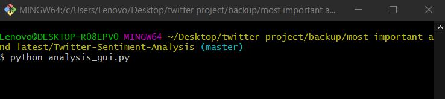
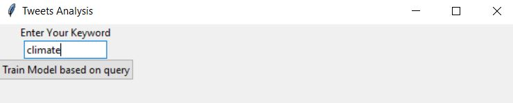
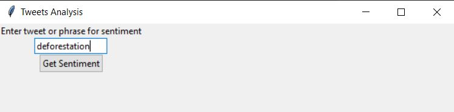
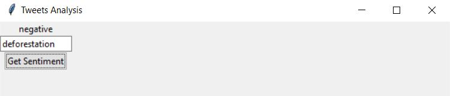

# Twitter Sentiment Analysis

Analysis of tweets by extracting sentiments

# Contents

1. Description
1. Installation
2. Usage
3. Contributing
4. Credits
5. License

# Description

This project focuses on extracting sentiments from tweets on twitter to identify the kind of emotion/sentiment associated with a particular person, thing, topic, idea, etc.

# Installation

1. It is always a good idea to create a virtual environment for such projects. Inside a desired directory create a virtual environment for this project. For windows use : **py -m venv env**
2. Activate the virtual environment using : **.\env\Scripts\activate**
3. Clone the project using : **git clone <ssh/https url>**
4. cd into the repository directory and run **pip install -r requirements.txt** to install the packages only for this virtual environment.

# Usage

1. You can run the application using the analysis_gui.py

2. Run it using python analysis_gui.py
   

3. This opens up a gui asking you to enter a word for fetching the tweets and training the model.
   

4. After training of the model, you can enter a word and then model predicts its sentiment.
   
   
   
5. Sentiment for the entered word
      

# Contributing

To contribute to the project follow the below steps

1. Fork the project
2. Follow the installation steps provided above on your local
3. For any additional feature or bug create a new issue. Or work on an existing issue.
4. Create a pull request mentioning the issue in your pull request.
